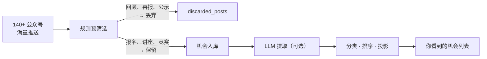

<div align="center">

<!-- TODO: 替换为 PRD 封面 / 项目 banner (建议 1280x480) -->


<br/>

<h2>荔知：规则驱动的校园机会发现引擎</h2>

**从信息混沌中，帮助你低成本获得高质量信息**
**点击 ⬇️⬇️⬇️ 体验**
<a href="http://106.52.9.231"></a>

**技术栈**


[功能](#功能亮点) · [快速开始](#快速开始) · [部署](#部署) · [API](#api-端点) · [文档](./docs/INDEX.md)

</div>


## 我们在解决什么问题

**一个深大学生平均关注 20+ 个校园公众号。**

- 每天推送的内容里，超过 60% 是活动回顾、公示结果、喜报贺信、会议纪要 — 这些信息对你已经没有行动价值，但它们占据了你的注意力和时间。
- 这么多社团，这么多官方账号，信息冗杂，根本来不及关注，也不知道有各种活动的存在。

> 你不是没有信息，你是 **被信息淹没了**。
> 真正重要的报名通知、截止提醒、竞赛征集被埋在海量回顾和宣传稿里。
> 结果就是：**认知负担过重，关键 deadline 被漏掉。**

荔知解决的核心问题：**信息杂乱所带来的认知负担。**


## 荔知做了什么

荔知是一个 **机会优先** 的校园信息聚合引擎。它从微信公众号抓取内容，用规则引擎在入库前就过滤掉不可操作的内容，**只保留你还能报名、还能参加、还能申请的机会**。



**之前**：打开微信 → 翻 20+ 个公众号 → 被回顾和喜报淹没 → 漏掉截止日期 → 焦虑

**之后**：打开荔知 → 只看到还能行动的机会 → 按截止日期排序 → 从容应对

### 和直接关注公众号有什么不同

| | 关注公众号 | 荔知 |
|---|---|---|
| 信息量 | 混杂，需要自己筛选 | 只有可操作的机会 |
| 截止提醒 | 埋在文章里，容易漏 | 按紧急程度排序，一眼看到 |
| 跨账号搜索 | 不可能 | 全局搜索 |
| 分类浏览 | 不可能 | 8 大分类 + 时间段筛选 |
| 推荐逻辑 | 微信黑盒算法 | 规则可解释，用户可控 |


## 功能亮点

| 功能 | 说明 |
|------|------|
| **规则预筛选** | 入库前就过滤回顾、总结、喜报等不可操作内容 |
| **8 大分类** | 校园活动 / 讲座论坛 / 志愿公益 / 竞赛征集 / 考试考核 / 招聘招募 / 通知公告 / 其他 |
| **截止时间排序** | 最紧急的机会排在最前面，不再错过 deadline |
| **时间段筛选** | 这周 / 这周末 / 下周，快速定位目标时间 |
| **全文搜索** | 搜索标题、摘要、来源 |
| **LLM 增强** | 可选接入大模型，自动提取标题、摘要、时间 |
| **深色模式** | 完整深色主题 |
| **中英双语** | 一键切换 |
| **一键部署** | PowerShell 脚本远程自动部署 |

<!-- TODO: 替换为实际截图 -->
<p align="center">
  
</p>


## 快速开始

### 环境要求

- Python 3.11+
- Node.js 18+
- npm 9+

### 启动后端

```bash
cd backend
pip install -r requirements.txt
cp ../.env.example ../.env   # 填入配置
python -m app.main
# → Backend running at http://localhost:8002
```

### 启动前端

```bash
cd frontend
npm install
npm run dev
# → Frontend running at http://localhost:3000
```

### 验证

```bash
cd backend && pytest          # 后端测试
cd frontend && npm run build  # 前端构建
```

## 配置

核心配置通过 `.env` 文件管理：

| 变量 | 默认值 | 说明 |
|------|--------|------|
| `BACKEND_HOST` | `0.0.0.0` | 监听地址 |
| `BACKEND_PORT` | `8002` | 监听端口 |
| `BACKEND_DATABASE_URL` | `sqlite:///` | 数据库连接串 |
| `BACKEND_SYNC_INTERVAL_MINUTES` | `10` | 自动同步间隔（分钟） |
| `BACKEND_UPSTREAM_BASE_URL` | — | WeRSS 上游地址 |
| `BACKEND_LLM_ENABLED` | `false` | 是否启用 LLM 增强 |
| `BACKEND_LLM_BASE_URL` | — | LLM API 地址（OpenAI 兼容） |
| `BACKEND_LLM_MODEL` | — | LLM 模型名称 |

<details>
<summary>完整配置项</summary>

| 变量 | 默认值 | 说明 |
|------|--------|------|
| `BACKEND_UPSTREAM_REFRESH_ENABLED` | `true` | 是否定时刷新上游源 |
| `BACKEND_UPSTREAM_REFRESH_INTERVAL_MINUTES` | `60` | 刷新间隔（分钟） |
| `BACKEND_UPSTREAM_REFRESH_ON_STARTUP` | `true` | 启动时立即刷新 |
| `BACKEND_LLM_QUEUE_ENABLED` | `true` | LLM 异步队列 |
| `BACKEND_LLM_WORKER_INTERVAL_SECONDS` | `20` | 队列处理间隔（秒） |
| `BACKEND_LLM_WORKER_BATCH_SIZE` | `2` | 每批处理数量 |
| `BACKEND_LLM_MAX_INPUT_CHARS` | `6000` | 单条最大输入字符 |

</details>


## API 端点

| 方法 | 路径 | 说明 |
|------|------|------|
| `GET` | `/api/posts` | 分页查询机会列表（搜索、分类、时间、排序） |
| `GET` | `/api/sources` | 获取信息源列表 |
| `POST` | `/api/sync` | 触发手动同步 |
| `GET` | `/api/health` | 健康检查 |
| `POST` | `/api/support` | 支持 / 点赞 |


## 项目结构

```
├── backend/
│   ├── app/
│   │   ├── api/routes/          # REST API 端点
│   │   ├── application/         # 业务逻辑
│   │   │   ├── classification.py
│   │   │   └── services/
│   │   ├── core/                # 配置
│   │   ├── db/                  # 数据模型 & 会话
│   │   ├── domain/              # 领域枚举
│   │   ├── infrastructure/      # WeRSS 连接器
│   │   └── main.py              # 入口
│   └── requirements.txt
├── frontend/
│   ├── src/
│   │   ├── App.vue              # 单文件应用
│   │   ├── api.js
│   │   └── main.js
│   └── package.json
├── scripts/
│   ├── deploy-cloud.ps1         # 一键部署
│   └── cloud/
└── docs/
```


## 部署

```powershell
.\scripts\deploy-cloud.ps1 -ServerHost your-server-ip -Domain lizhi.example.com
```

自动完成：构建前端 → 打包后端 → 上传 → 配置 Caddy → 启动服务。


## 贡献

1. Fork 本仓库
2. 创建分支 (`git checkout -b feature/amazing-feature`)
3. 提交 (`git commit -m 'Add amazing feature'`)
4. 推送 (`git push origin feature/amazing-feature`)
5. 发起 Pull Request

## 相关文档

- [Agent.md](./Agent.md) — 开发协议与工程原则
- [docs/INDEX.md](./docs/INDEX.md) — 文档总入口
- [docs/backend-rebuild/iter-1-prd.md](./docs/backend-rebuild/iter-1-prd.md) — 迭代一 PRD


<div align="center">

[](LICENSE)

<br/>

<sub>Built by <a href="https://github.com/porridgeowefish">哈基米南北绿豆团队</a></sub>

</div>
