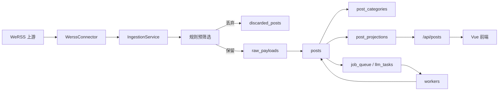

# 代码分类与修改指南

最后梳理日期：`2026-05-28`

这份文档按职责分类说明 `lizhi` 文件夹内的代码。后续修改功能时，建议先看这里，再进入具体源码文件。

## 系统概览

`lizhi` 是一个校园信息聚合平台。当前实现是 Vue 前端 + FastAPI 后端。后端从 WeRSS/微信公众号上游拉取文章，先用规则过滤掉回顾、公示、喜报、乱码、非校园等不可操作内容，再把可参与、可报名、可申请的信息入库，生成分类、时间、排序、展示投影，并通过 `/api/*` 提供给前端。



## 顶层目录分类

| 路径 | 分类 | 内容 | 什么时候改 |
| --- | --- | --- | --- |
| `backend/` | 后端应用 | FastAPI、SQLAlchemy 模型、采集服务、规则分类、worker、测试 | 改 API、数据库、筛选、排序、同步、LLM、后台任务 |
| `frontend/` | 前端应用 | Vite/Vue 页面、组件、静态设计稿、图片资产 | 改首页 UI、筛选项、中英文本、后台看板、前端接口调用 |
| `docs/` | 项目文档 | 当前契约、重构记录、治理文档、截图 | 改架构说明、PRD 对齐、交接说明 |
| `scripts/` | 运维脚本 | 本地启动、停止、云部署、远程 systemd/nginx 配置 | 改本地启动方式、服务器部署、worker 定时器 |
| `Agent.md`, `CLAUDE.md` | 协作规则 | 工程约束和协作说明 | 一般不改，除非团队工作流变化 |
| `README.md` | 项目入口 | 产品介绍、快速开始、API 摘要 | 改面向用户的介绍、安装步骤、功能概览 |

## 后端分类

### 运行入口

| 文件 | 作用 |
| --- | --- |
| `backend/app/main.py` | 创建 FastAPI app，构建数据库/session/service，注册路由，启动可选的进程内定时任务，直接执行时启动 uvicorn。 |
| `backend/app/core/config.py` | 从环境变量读取所有 `BACKEND_*` 配置到 `Settings`。本地默认数据库是 `.run/backend.db`。 |
| `backend/requirements.txt` | 后端依赖：FastAPI、Uvicorn、SQLAlchemy、APScheduler、httpx、pydantic、dotenv、pytest。 |

重要说明：云端部署脚本会设置 `BACKEND_ENABLE_SCHEDULER=false`，生产环境主要依赖 systemd timers + 独立 worker，而不是后端进程内 scheduler。

### 数据库层

| 文件 | 作用 |
| --- | --- |
| `backend/app/db/base.py` | SQLAlchemy declarative base。 |
| `backend/app/db/session.py` | 创建 engine/session，配置 SQLite pragma，自动建表，补少量字段，删除旧表。 |
| `backend/app/db/models.py` | 全部数据库模型。 |

主要表：

| 表 | 用途 |
| --- | --- |
| `sources` | 微信公众号/WeRSS 信息源。 |
| `raw_payloads` | 通过预筛选后保存的上游原始文章 payload。 |
| `posts` | 平台展示的主内容表。 |
| `post_categories` | 每篇文章的分类标签。 |
| `post_projections` | 用于筛选、排序、展示、排名的派生字段。 |
| `discarded_posts` | 被规则预筛选丢弃的文章，保存原因和命中证据。 |
| `sync_jobs`, `sync_job_items` | 同步任务审计和每个阶段的进度。 |
| `job_queue` | 刷新、抓正文、LLM 等后台任务的数据库队列。 |
| `llm_tasks` | `LlmQueueService` 使用的 LLM 任务跟踪表。 |
| `support_clicks` | 用户“加荔枝”支持点击，每个 client token 只计一次。 |

### 领域枚举

| 文件 | 作用 |
| --- | --- |
| `backend/app/domain/enums.py` | 集中定义 source/content/display/LLM/time/participation/sync/job/discard 等状态枚举。 |

注意：这些枚举值会直接存入数据库，也会返回给前端。改字符串值时要同步改前端显示和测试。

### 规则分类与投影

| 文件 | 作用 |
| --- | --- |
| `backend/app/application/classification.py` | 核心规则引擎。负责预筛选、分类、HTML 清理、内容 hash、时间提取、参与状态、展示等级、排序分、摘要兜底、LLM 输出校验。 |

常见修改点：

| 目标 | 主要修改位置 |
| --- | --- |
| 增加或调整分类 | `CATEGORY_RULES`、`VALID_CATEGORIES`、前端分类文案 |
| 过滤更多无效内容 | `EXCLUDE_RULES`、`DIRECT_PREFIXES`、非校园关键词列表 |
| 改进日期/截止时间识别 | `TIME_PATTERNS`、`DATE_RANGE_PATTERN`、deadline/start/end hints |
| 调整首页可见性和排序信号 | `derive_time_status`、`derive_participation_status`、`derive_display_level`、`compute_ranking_score` |
| 调整 LLM 可接受输出 | `_validate_llm_output`、`parse_llm_payload` |

### 采集与查询服务

| 文件 | 作用 |
| --- | --- |
| `backend/app/application/services/ingestion_service.py` | 主采集管线：拉 source/post，两次预筛选，必要时抓详情正文，写 raw/post/category/projection/discard，按需创建 LLM 任务。 |
| `backend/app/application/services/query_service.py` | 读侧查询：文章列表、分类统计、来源列表、同步任务。这里负责首页默认可见范围和排序。 |
| `backend/app/application/services/job_queue_service.py` | 通用数据库队列：入队、活跃任务去重、领取、成功/失败标记、统计。 |
| `backend/app/application/services/llm_service.py` | OpenAI 兼容的 chat-completions 调用，用于抽取标题、摘要、分类、时间。 |
| `backend/app/application/services/llm_queue_service.py` | 处理 `llm_tasks`，调用 `LlmService`，把 LLM 结果写回 post/category/projection。 |

采集流程：

1. 从 WeRSS 拉取 sources。
2. 写入或更新 `sources`。
3. 对每个 source 拉取 posts。
4. 增量同步遇到上次 high-water upstream post id 就停止。
5. 用标题、摘要、来源、正文片段做第一次预筛选。
6. 被拒绝的写入 `discarded_posts`。
7. 允许通过的写入 `raw_payloads`。
8. 如果列表 payload 没有正文，尝试抓详情。
9. 用更长正文做第二次预筛选。
10. 写入或更新 `posts`。
11. 生成 `post_categories` 和 `post_projections`。
12. 如果启用 LLM 且内容足够，创建 LLM 任务。

### HTTP API

| 文件 | 路由 | 作用 |
| --- | --- | --- |
| `backend/app/api/deps.py` | shared dependency | 每个请求打开并关闭数据库 session。 |
| `backend/app/api/serializers.py` | shared serialization | 把 SQLAlchemy model 转成 Pydantic response。 |
| `backend/app/api/routes/posts.py` | `GET /api/posts`, `GET /api/posts/categories`, `GET /api/posts/{id}` | 机会列表、分类统计、详情。 |
| `backend/app/api/routes/sources.py` | `GET /api/sources` | 信息源列表。 |
| `backend/app/api/routes/sync.py` | `POST /api/sync`, `GET /api/sync/jobs/{id}`, LLM queue endpoints | 手动同步、同步状态、LLM 队列状态。 |
| `backend/app/api/routes/jobs.py` | `/api/jobs/*` | 创建刷新/回填任务、队列统计、采集健康数据。 |
| `backend/app/api/routes/support.py` | `GET/POST /api/support` | 支持点击计数和 client 去重。 |
| `backend/app/api/routes/health.py` | `GET /api/health` | 数据库和上游配置健康检查。 |
| `backend/app/schemas/responses.py` | response models | 所有主要响应结构。 |

### 上游连接器

| 文件 | 作用 |
| --- | --- |
| `backend/app/infrastructure/connectors/werss.py` | 负责 WeRSS 登录、拉来源、拉文章列表/详情、触发上游 source refresh、刷新文章详情。 |

当前使用的 WeRSS 接口：

| Method/Path | 用途 |
| --- | --- |
| `POST /api/v1/wx/auth/login` | 获取 access token。 |
| `GET /api/v1/wx/mps` | 拉公众号来源。 |
| `GET /api/v1/wx/articles` | 按 source 拉文章列表。 |
| `GET /api/v1/wx/mps/update/{source_id}` | 刷新某个来源的上游分页。 |
| `GET /api/v1/wx/articles/{post_id}` | 拉文章详情。 |
| `POST /api/v1/wx/articles/{post_id}/refresh` | 上游支持时刷新缺失/失效的文章详情。 |

### 后台 Workers

| 文件 | 队列类型 | 作用 |
| --- | --- | --- |
| `backend/app/workers/enqueue_refresh_jobs.py` | 创建 `refresh_source` | 给启用的 source 定时创建刷新任务；如果已有刷新积压则跳过。 |
| `backend/app/workers/refresh_worker.py` | 消费 `refresh_source`, `sync_source_posts` | 刷新 WeRSS source 页，然后同步单个 source 的文章，并创建抓正文/LLM 后续任务。 |
| `backend/app/workers/content_worker.py` | 消费 `fetch_content` | 抓缺失正文，更新 `posts`，按需创建 `llm_post`。 |
| `backend/app/workers/llm_worker.py` | 消费 `llm_post` | 把 `job_queue` 里的 LLM job 转接给 `LlmQueueService`。 |

本地一次性运行示例：

```bash
cd backend
python3 -m app.workers.enqueue_refresh_jobs --once --limit 5
python3 -m app.workers.refresh_worker --once --limit 1
python3 -m app.workers.content_worker --once --limit 5
python3 -m app.workers.llm_worker --once --limit 2
```

## 前端分类

### 运行与接口层

| 文件 | 作用 |
| --- | --- |
| `frontend/package.json` | Vite/Vue 脚本和依赖。 |
| `frontend/vite.config.js` | 开发环境把 `/api` 代理到 `http://127.0.0.1:8002`。 |
| `frontend/index.html` | 根 HTML、页面标题、Google 字体。 |
| `frontend/src/main.js` | 挂载 Vue app。 |
| `frontend/src/api.js` | axios 封装后端接口。 |

### 用户主页面

| 文件 | 作用 |
| --- | --- |
| `frontend/src/App.vue` | 主单文件应用。包含首页和 `/admin/status` 切换、页面结构、状态、i18n 文案、筛选、支持按钮、引导浮层、深色模式和大量 CSS。 |

首页主要状态：

| 状态 | 用途 |
| --- | --- |
| `posts`, `total`, `offset` | `GET /api/posts` 返回的分页列表。 |
| `filters` | 分类、时间范围、排序方式。 |
| `draftSearch`, `activeSearch` | 搜索框输入和已应用搜索词。 |
| `expandedId` | 当前展开的文章卡片。 |
| `lastSyncJob`, `syncing` | 手动同步结果和加载状态。 |
| `supportCount`, `supportLiked` | “加荔枝”状态，来自 `/api/support` 和 localStorage。 |
| `lang`, `darkMode` | 语言和主题，保存在 localStorage。 |

文章卡片使用的后端字段：

| 后端字段 | 展示用途 |
| --- | --- |
| `llm_title || title` | 卡片标题。 |
| `llm_summary || summary` | 卡片摘要。 |
| `primary_category` | 分类标签。 |
| `published_at` | 发布时间。 |
| `key_time_at`, `key_time_type` | 截止/活动时间紧急标签。 |
| `event_start_at`, `event_end_at`, `deadline_at` | 展开后的时间详情。 |
| `source_name` | 来源标签。 |
| `original_url` | 原文链接。 |

### 后台状态页

| 文件 | 路由 | 作用 |
| --- | --- | --- |
| `frontend/src/components/AdminStatus.vue` | `/admin/status` | 运维看板：API 健康、队列状态、采集健康、24 小时新增、内容分布、管线图。 |

说明：项目没有 Vue Router。`App.vue` 通过 `window.location.pathname` 判断是否是 `/admin/status`，是的话渲染 `AdminStatus`。

### 静态资产和设计稿

| 路径 | 作用 |
| --- | --- |
| `frontend/public/assets/` | 静态参考图片。 |
| `frontend/*.svg`, `frontend/lychee-*.html` | Logo/视觉探索文件。 |
| `frontend/design-mocks/`, `frontend/admin-dashboards/` | 静态 HTML 设计 mock。 |

## 脚本与部署

| 文件 | 作用 |
| --- | --- |
| `scripts/start-dev-stack.ps1` | 启动后端 `127.0.0.1:8002` 和前端 `127.0.0.1:3000`，日志/PID 写到 `.run/`。 |
| `scripts/start-dev-stack.cmd` | Windows cmd 包装脚本。 |
| `scripts/stop-dev-stack.ps1` | 根据 PID 文件停止本地 dev 进程。 |
| `scripts/deploy-cloud.ps1` | 构建前端、打包后端/前端/scripts、上传服务器并执行远程部署。 |
| `scripts/cloud/remote-deploy.sh` | 服务器上安装依赖、创建 venv、写 systemd/nginx 配置、启用服务和 timers。 |
| `scripts/cloud/backend.env.example` | 生产环境变量示例。 |
| `scripts/cloud/llm_backfill.py` | 单进程 drain `llm_tasks` 队列。 |
| `scripts/cloud/llm_backfill_sync.py` | `llm_backfill.py` 的兼容包装。 |

云端运行布局来自 `remote-deploy.sh`：

| 区域 | 路径/Unit |
| --- | --- |
| 应用目录 | `/opt/campus-opportunity/current` |
| 数据目录 | `/var/lib/campus-opportunity` |
| 环境变量文件 | `/etc/campus-opportunity/backend.env` |
| 后端服务 | `campus-opportunity-backend.service` |
| 定时器 | enqueue refresh、refresh worker、content worker、LLM worker |
| Web 服务 | nginx，`/api/` 代理到 `127.0.0.1:8002`，其余请求服务 `frontend/dist` |

## 测试分类

| 文件 | 覆盖内容 |
| --- | --- |
| `backend/tests/test_api.py` | API 列表/详情/同步/支持按钮、排序、默认可见范围、分类统计。 |
| `backend/tests/test_classification.py` | 预筛选、分类、内容类型、时间提取、LLM 输出校验、排序分。 |
| `backend/tests/test_job_queue.py` | 队列去重、job API、refresh/content worker、增量 high-water。 |

推荐验证命令：

```bash
cd backend
python3 -m pytest

cd frontend
npm run build
```

## 常见修改地图

| 你想改什么 | 主要文件 |
| --- | --- |
| 增加一个机会分类 | `classification.py`、必要时 `schemas/responses.py`、`frontend/src/App.vue`、`AdminStatus.vue` 文案、测试 |
| 改首页显示哪些文章 | `QueryService.list_posts`、`classification.py` 投影函数、前端卡片渲染 |
| 调整回顾/公示/乱码/非校园过滤 | `classification.py` 里的 `prescreen_post` 和规则常量、分类测试 |
| 改进截止时间/活动时间解析 | `classification.py` 的 `extract_time_signals`，语义变化时同步查询排序和 API 测试 |
| 改 API 返回字段 | `schemas/responses.py`、`api/serializers.py`、前端 `api.js`/Vue 使用处 |
| 新增后端接口 | `backend/app/api/routes/` 新增或修改 route，`main.py` 注册，补 schema/tests，必要时补前端 API wrapper |
| 新增前端筛选控件 | `App.vue` 的 filter state/buildParams，后端 `QueryService.list_posts`，API 测试 |
| 修改 WeRSS 对接 | `infrastructure/connectors/werss.py`、`IngestionService`、测试里的 connector stub |
| 修改 LLM prompt/输出结构 | `LlmService.summarize_and_extract`、`_validate_llm_output`、`LlmQueueService._apply_llm_result`、测试 |
| 修改后台处理频率 | `Settings`、`scripts/cloud/remote-deploy.sh` timer、worker 代码 |
| 修改部署路径/域名 | `scripts/deploy-cloud.ps1`、`scripts/cloud/remote-deploy.sh`、生产 env 文件 |
| 修改“加荔枝”支持按钮 | `support.py`、`SupportClick`、`App.vue` 支持按钮状态/UI |

## 已发现的风险和后续整理建议

1. `frontend/src/App.vue` 非常大，混合了结构、状态、i18n 和 CSS。后续前端改动多时，建议拆出筛选栏、文章卡片、支持按钮、主题/i18n 常量。
2. `frontend/src/components/AdminStatus.vue` 也很大，混合了数据加载、文案、Mermaid 图和 CSS。
3. `backend/app/application/classification.py` 是规则核心，改规则很容易造成误杀或漏筛。每次改规则都应补定向测试。
4. `backend/app/application/services/ingestion_service.py` 负责太多阶段和数据库写入。大改时建议按预筛选、upsert、projection、queueing 分块验证。
5. LLM 现在有两条协作路径：`llm_tasks` + `LlmQueueService`，以及 `job_queue` 的 `llm_post` + `LlmWorker`。后续不要再引入第三套 LLM 队列。
6. `docs/backend-rebuild/` 下部分旧文档早于当前代码。没有刷新这些旧文档前，以本文件和源码为当前分类快照。
7. `backend/app/main.py` 的 scheduler 配置对缩进敏感，修改后一定要做语法检查。

## 本地快速启动

后端：

```bash
cd backend
python3 -m venv .venv
. .venv/bin/activate
pip install -r requirements.txt
python3 -m uvicorn app.main:app --host 127.0.0.1 --port 8002
```

前端：

```bash
cd frontend
npm install
npm run dev
```

访问：

- 前端：`http://127.0.0.1:3000`
- 后端健康检查：`http://127.0.0.1:8002/api/health`
- 后台状态页：`http://127.0.0.1:3000/admin/status`
