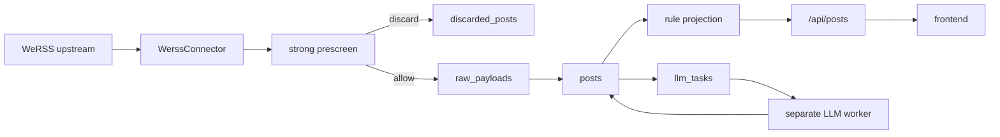

# Documentation Index

This repository keeps one active documentation set. Historical alignment drafts and obsolete mocks are deleted instead of archived when they compete with the current contract.

## Read Order

1. [governance/DOCUMENT_REGISTRY.md](governance/DOCUMENT_REGISTRY.md)
2. [CODEBASE_CLASSIFICATION.md](CODEBASE_CLASSIFICATION.md)
3. [governance/ALIGNMENT_CONSENSUS.md](governance/ALIGNMENT_CONSENSUS.md)
4. [backend-rebuild/iter-1-prd.md](backend-rebuild/iter-1-prd.md)
5. [backend-rebuild/current-state.md](backend-rebuild/current-state.md)
6. [backend-rebuild/backend-consensus.md](backend-rebuild/backend-consensus.md)
7. [backend-rebuild/stability-audit.md](backend-rebuild/stability-audit.md)
8. [backend-rebuild/remediation-board.md](backend-rebuild/remediation-board.md)
9. [backend-rebuild/traffic-isolation-plan.md](backend-rebuild/traffic-isolation-plan.md)
10. [backend-rebuild/mvp-2-article-pipeline.md](backend-rebuild/mvp-2-article-pipeline.md)
11. [backend-rebuild/deployment-notes.md](backend-rebuild/deployment-notes.md)

## Active Contract

| Area | Current Agreement |
| --- | --- |
| Product unit | `post` |
| Public content API | `/api/posts` |
| Core tables | `sources`, `raw_payloads`, `posts`, `post_categories`, `post_projections`, `discarded_posts`, `sync_jobs`, `sync_job_items` |
| Prescreen policy | Strong rules before raw storage and LLM |
| Ranking policy | Rule-derived `ranking_score`, never LLM scoring |
| Frontend rendering | Opportunity-first feed with sanitized `content_html` only in detail |
| Traffic isolation | Online API does not run upstream refresh or LLM workers in-process |
| MVP 2 pipeline | DB-backed job queue with refresh/content/LLM workers |

## Architecture Snapshot

