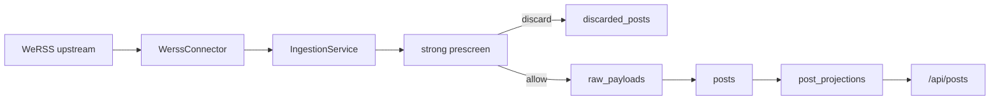
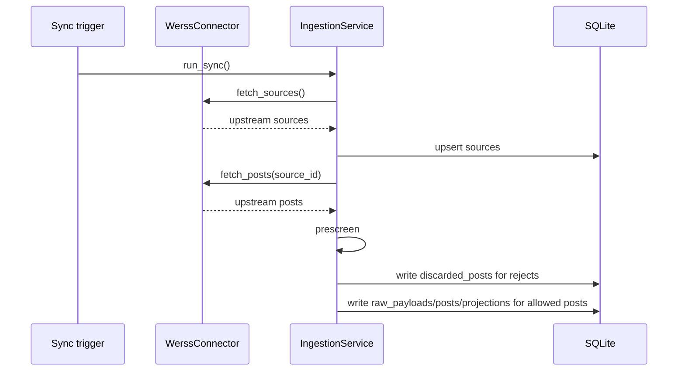

# Current Backend State

Last updated: `2026-05-22`

## Summary

The backend is a FastAPI service that projects WeRSS upstream content into an opportunity-first local store. The active content unit is `post`.

## Runtime Topology

## Implemented Tables

- `sources`
- `raw_payloads`
- `posts`
- `post_categories`
- `post_projections`
- `discarded_posts`
- `sync_jobs`
- `sync_job_items`

Legacy content tables are dropped during startup if found.

## Public API

- `GET /api/posts`
- `GET /api/posts/{post_id}`
- `GET /api/posts/categories`
- `GET /api/sources`
- `POST /api/sync`
- `GET /api/sync/jobs/{job_id}`
- `GET /api/health`

## Sync Pipeline

## Prescreen Contract

The following classes are strongly excluded before raw storage and before LLM:

- `recap`
- `closure`
- `congratulation`
- `publicity_result`
- `introduction`
- `opinion`
- `tutorial`
- `record_only`
- `garbled_hidden_source`

Every discard stores reason, stage, rule version, matched fields, matched keywords, and quality signals for garbled content.

## Configuration

| Variable | Meaning | Default |
| --- | --- | --- |
| `BACKEND_DATABASE_URL` | backend database URL | `sqlite:///.run/backend.db` for local default; `/var/lib/campus-opportunity/backend.db` in cloud |
| `BACKEND_POST_FETCH_LIMIT` | posts fetched per source | `50` |
| `BACKEND_SOURCE_FETCH_LIMIT` | max sources fetched | `200` |
| `BACKEND_UPSTREAM_BASE_URL` | WeRSS API base URL | empty |
| `BACKEND_UPSTREAM_USERNAME` | WeRSS username | empty |
| `BACKEND_UPSTREAM_PASSWORD` | WeRSS password | empty |
| `BACKEND_LLM_ENABLED` | enables optional LLM extraction | `false` |

## Cloud Acceptance Snapshot

Cloud acceptance must be checked against the running server, not local sample databases:

- `/api/health` returns `ok`
- `/api/posts` returns from the `posts` projection
- `/api/sync` completes or partial-completes with observable discard stats
- cloud database contains only the active table set
- old app service and old app directories are removed, while upstream WeRSS support data is preserved
