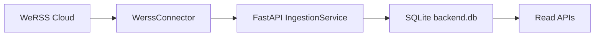
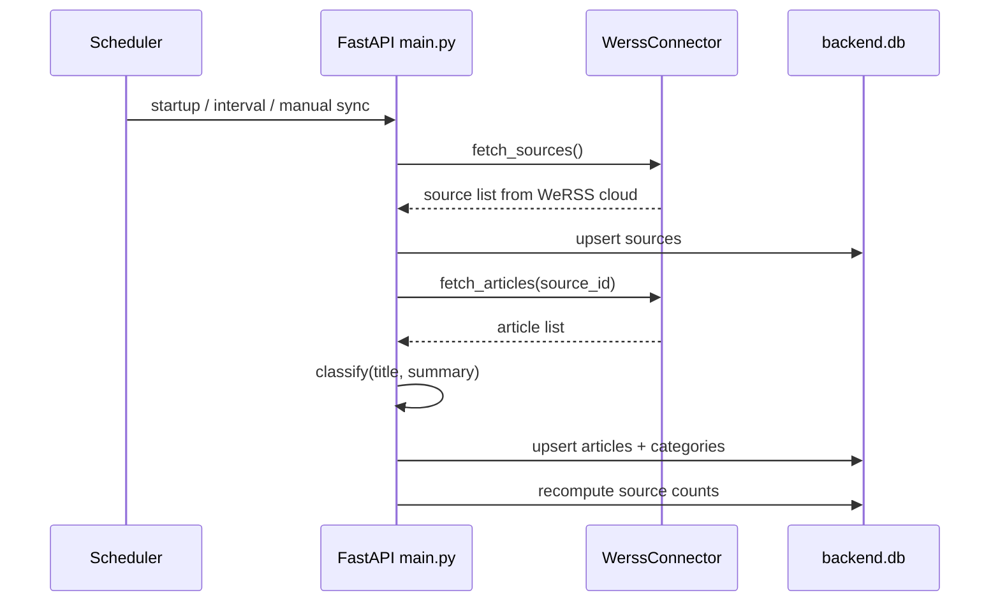

# Current Backend State

## 1. Summary

当前后端是一个以 FastAPI 为壳、以 WeRSS 云端为上游、以 SQLite 为本地投影库的轻量单体服务。

它当前完成了三件事：

1. 从 WeRSS 云端拉取公众号与文章
2. 将部分字段投影到本地 SQLite
3. 对外提供只读查询与手动同步接口

## 2. Runtime Topology

## 3. Code Structure

### Core Files

- [main.py](/D:/2_Study/哈基米南北绿豆/backend/app/main.py)
- [config.py](/D:/2_Study/哈基米南北绿豆/backend/app/core/config.py)
- [session.py](/D:/2_Study/哈基米南北绿豆/backend/app/db/session.py)
- [models.py](/D:/2_Study/哈基米南北绿豆/backend/app/db/models.py)
- [werss.py](/D:/2_Study/哈基米南北绿豆/backend/app/infrastructure/connectors/werss.py)
- [ingestion_service.py](/D:/2_Study/哈基米南北绿豆/backend/app/application/services/ingestion_service.py)
- [query_service.py](/D:/2_Study/哈基米南北绿豆/backend/app/application/services/query_service.py)
- [classification.py](/D:/2_Study/哈基米南北绿豆/backend/app/application/classification.py)

### Organization Pattern

- DDD-style layered: core / domain / application / infrastructure / api
- Connector pattern for upstream integration
- Sync job observability at job and item level

## 4. Databases

### 4.1 Local Projection DB

文件：`backend/data/backend.db`

表：

- `sources`
  - `id`, `upstream_source_id`, `name`, `source_type`, `status`, `cover_url`, `intro`, `article_count`, `last_synced_at`, `created_at`, `updated_at`
- `articles`
  - `id`, `upstream_article_id`, `source_id`, `source_name_snapshot`, `title`, `summary`, `original_url`, `cover_url`, `published_at`, `content_html`, `content_status`, `content_type`, `display_level`, `ingestion_status`, `created_at`, `updated_at`
- `article_categories`
  - `id`, `article_id`, `category_code`, `category_source`
- `sync_jobs`
  - `id`, `trigger_type`, `status`, `sources_synced`, `articles_fetched`, `articles_inserted`, `articles_updated`, `error_summary`, `started_at`, `finished_at`, `created_at`, `updated_at`
- `sync_job_items`
  - `id`, `sync_job_id`, `source_id`, `stage`, `status`, `item_count`, `error_message`, `started_at`, `finished_at`

## 5. Current API

### Public APIs

- `GET /api/articles` — 分页列表查询，支持 category, content_type, search, source_id, offset, limit, show_all
- `GET /api/articles/{article_id}` — 文章详情，显式 404
- `GET /api/articles/categories` — 分类统计 + content_type_stats
- `GET /api/sources` — 来源列表
- `POST /api/sync` — 手动触发同步，返回 sync job 结果
- `GET /api/sync/jobs/{job_id}` — 查看同步任务详情
- `GET /api/health` — 健康检查

### Upstream Dependency

Backend connects directly to WeRSS cloud via `WerssConnector`:

- `POST /api/v1/wx/auth/login` — 登录
- `GET /api/v1/wx/mps` — 拉取公众号列表
- `GET /api/v1/wx/articles` — 拉取文章列表

## 6. Current Sync Mechanism

### Sync Characteristics

- 启动后自动同步一次
- APScheduler 每 10 分钟同步一次
- 文章以 `upstream_article_id` 去重
- 分类基于关键词规则引擎
- 同步任务有 job 和 item 级别可观测性
- 当 upstream 未配置时，同步功能自动禁用

## 7. Configuration

| Environment Variable | Description | Default |
| --- | --- | --- |
| `BACKEND_HOST` | 监听地址 | `0.0.0.0` |
| `BACKEND_PORT` | 监听端口 | `8002` |
| `BACKEND_DATABASE_URL` | 数据库 URL | `sqlite:///backend/data/backend.db` |
| `BACKEND_UPSTREAM_BASE_URL` | WeRSS 云端 API 地址 | (空) |
| `BACKEND_UPSTREAM_USERNAME` | WeRSS 用户名 | (空) |
| `BACKEND_UPSTREAM_PASSWORD` | WeRSS 密码 | (空) |
| `BACKEND_SYNC_INTERVAL_MINUTES` | 同步间隔 | `10` |
| `BACKEND_ARTICLE_FETCH_LIMIT` | 每源文章数 | `50` |
| `BACKEND_SOURCE_FETCH_LIMIT` | 来源数 | `100` |
| `BACKEND_ENABLE_SCHEDULER` | 启用定时同步 | `true` |

## 8. Verified Scale Snapshot

Snapshot verified on `2026-05-22`.

- upstream cloud sources: `146`
- upstream cloud articles: `538`
- local projection articles after fresh manual sync: `540`

These numbers are operational facts, not product guarantees.

What they prove:

- the upstream cloud is materially larger than the earlier local `94` article snapshot
- the backend can project the current upstream dataset into the local SQLite database

What they do not prove:

- that iter-1 is complete against the PRD
- that sync semantics are formally documented and regression-tested
- that time-aware governance or rule-based ranking already exist

## 9. Known Gaps Relative To Iter-1 PRD

The current backend still lacks these PRD-critical capabilities:

- `event_start_at`
- `event_end_at`
- `deadline_at`
- `time_status`
- `timeliness_level`
- default hiding based on timeliness
- `time_status` query filtering
- rule-based opportunity ranking
