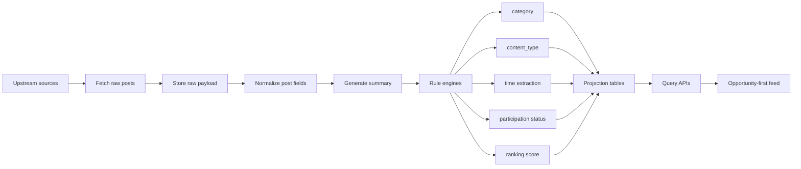
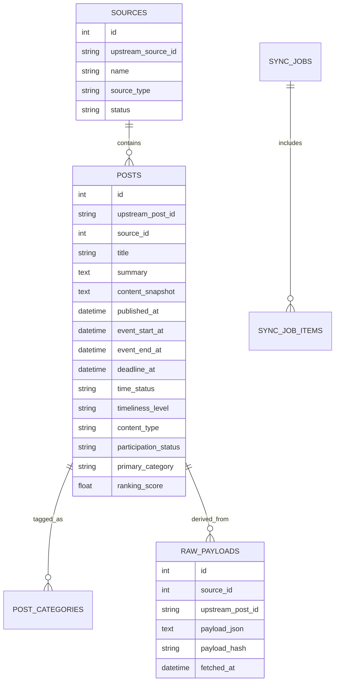
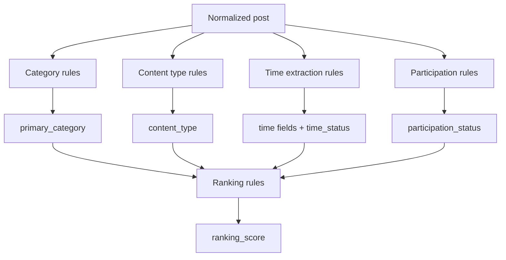
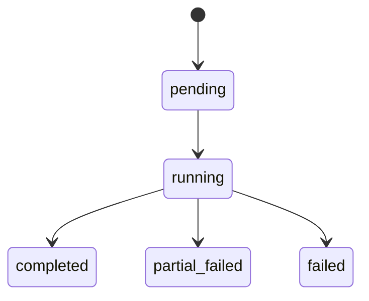

# Iteration 1 PRD - Rule-First Opportunity Engine

## 0. Document Status

- version: `2026-05-22`
- status: `active`
- owner: `project team`
- source of truth scope:
  - iter-1 target contract
  - rule-first opportunity discovery logic
  - data and API direction for stable backend evolution

---

## 1. Iteration Goal

本轮迭代不再把目标定义成“把内容同步下来并做基础过滤”，而是要把系统升级为一个**规则优先、机会优先、时效优先**的校园信息机会引擎。

本轮必须解决的核心变化是：

1. 系统要能处理已经发生的 `500+` 上游帖子规模，而不是建立在几十条样本上的假设。
2. 系统默认要区分“可参与机会”和“不可参与内容”，而不是只区分“有没有活动感”。
3. 排序必须从“按发布时间倒序”升级为“规则加权排序”，并且**不依赖任何 LLM 打分**。
4. 时间提取必须成为正式能力，服务于“是否还值得看”这一业务目标。
5. 存储要从“把上游内容塞进本地库”升级为“原始载荷、规范化摘要、查询投影分层”。

一句话目标：

> 把当前系统从“能同步内容的聚合后端”升级为“能稳定识别和筛出高价值可参与机会的规则引擎后端”。

---

## 2. Product Positioning for Iter-1

### 2.1 What This Product Is

这是一个面向深圳大学学生的**校园机会发现后端**。

它服务的不是“看完所有内容”，而是：

- 更快发现可报名、可参加、可申请、可投递、可关注的机会
- 默认压低回顾、总结、战报、公示、名单、纯宣传类内容
- 在信息规模继续增长时，仍然能维持高信噪比

### 2.2 What This Product Is Not

它不是：

- 通用内容信息流产品
- 社交平台
- 依赖 LLM 黑箱评分的推荐系统
- 为了“多功能”而扩展的管理后台集合

### 2.3 Iter-1 Product Promise

iter-1 的产品承诺只有三条：

1. **先筛可参与，再谈展示体验**
2. **先规则可解释，再谈推荐智能化**
3. **先数据结构稳定，再谈更多页面与功能**

---

## 3. Scope

### 3.1 In Scope

- 上游来源同步
- 帖子标准化入库
- 原始载荷保留策略
- 摘要生成与摘要存储策略
- 活动/机会类型识别
- 内容类型识别
- 时间提取
- 时效状态推导
- 可参与 / 不可参与判定
- 规则加权排序
- 默认主列表治理
- 搜索与筛选
- 同步任务可观测性
- 面向后续 5k / 50k 数据量的结构设计

### 3.2 Out of Scope

- 用户账号体系
- 收藏 / 已读 / 订阅中心正式实现
- 评论、互动、UGC
- LLM 个性化推荐
- 多租户后台
- 完整管理端 UI
- 跨校扩展运营方案

### 3.3 Iter-1 Non-Negotiables

以下能力在本轮不是“可选增强”，而是必做：

- 时间字段正式进入 schema
- 排序从纯时间倒序升级为规则排序
- 可参与 / 不可参与成为明确字段
- 数据规模与存储策略进入 PRD，而不是留到实现时再想

---

## 4. User Stories

### US-1 机会优先浏览

作为一个想快速找到机会的深大学生，
我希望默认列表优先展示仍可参与、仍未过期、仍值得行动的内容，
以便我不用从大量回顾和宣传里手工筛选。

### US-2 可参与过滤

作为一个只想看“我现在还能做什么”的学生，
我希望系统能明确区分可参与与不可参与内容，
以便我第一眼看到的是报名、申请、讲座、比赛、志愿、招聘等机会。

### US-3 历史内容可查但不抢主位

作为一个错过信息的学生，
我希望历史内容仍然可以被搜索和查看，
但不会默认挤占主列表的注意力。

### US-4 规则可解释

作为产品和开发团队成员，
我希望系统的分类、时间判断、排序结果是可解释的，
以便我们能调规则、查错、回溯，而不是只能猜模型为什么这么判。

### US-5 海量增长下仍可维护

作为系统维护者，
我希望即使上游帖子数量从 `500+` 增长到 `5k+`、`50k+`，
系统的存储、同步、查询和规则处理仍然有明确演进路线，
以便我们不会在下一轮迭代时推倒重来。

### US-6 同步质量可追踪

作为维护者，
我希望看到每次同步拉了多少来源、多少帖子、哪些阶段失败、哪些来源为空，
以便定位问题时不依赖猜测。

---

## 5. Product Logic

### 5.1 Core Decision Principle

系统不再问“这条内容是不是文章”，而是依次问：

1. 这是不是一个机会类内容？
2. 这个机会现在还能参与吗？
3. 如果还能参与，它价值高不高、急不急、值不值得排前？

### 5.2 Content Unit

为了兼容公众号文章、推文式短帖、活动公告等不同来源，本 PRD 统一使用 `post` 作为内容单元。

当前实现可以继续以 WeRSS 文章为主要输入，但目标模型必须面向更通用的帖子单元，而不是只绑定某个上游命名。

### 5.3 Default Feed Contract

- 默认列表只返回 `display_level != hidden` 的内容
- 默认列表只返回 `timeliness_level != hidden` 的内容
- 默认列表优先展示 `participation_status = participable`
- 默认排序不再是纯 `published_at desc`
- 默认主列表是“机会流”，不是“全文内容归档流”

### 5.4 Archive Contract

- 搜索和 `show_all=true` 可以进入低优先级内容
- 不可参与内容可以被保留，但不应默认压住机会流
- 历史内容的价值是“可追溯”，不是“默认抢主位”

---

## 6. Data Pipeline

### 6.1 End-to-End Flow



### 6.2 Pipeline Layers

#### Layer 1: Raw Payload

保留上游原始字段或原始 JSON，用于：

- 规则重跑
- 问题排查
- 上游字段变化适配

#### Layer 2: Normalized Post

抽取统一字段：

- `title`
- `summary`
- `source_id`
- `published_at`
- `original_url`
- `cover_url`
- `content_text` 或 `content_html`

#### Layer 3: Projection

将规则结果写入查询投影，用于：

- 主列表
- 搜索
- 分类统计
- 同步质量看板

---

## 7. Data Storage Strategy

### 7.1 Why Storage Strategy Is Now A Product Requirement

当前上游已经不是几十条样本，而是 `500+` 内容规模。
如果此时仍然只考虑“能不能先存进去”，后续的摘要重算、规则迁移、排序修复都会非常痛苦。

### 7.2 Storage Decision

本轮采用三层存储：

1. `raw payload`
2. `normalized post`
3. `query projection`

### 7.3 Original Text vs Summary

#### We Will Keep

- 原始载荷
- 结构化摘要
- 原文链接
- 必要时的正文快照

#### We Will Not Depend On

- 直接把原文全文作为唯一业务输入
- 只靠原文 HTML 驱动排序和筛选

### 7.4 Summary Policy

摘要是主列表和搜索的核心字段。

摘要生成原则：

- 先使用上游已有摘要
- 没有摘要时，使用规则抽取前若干有效句
- 摘要服务于筛选和浏览，不服务于“重写原文”

### 7.5 Storage Topology



---

## 8. Rule Systems

### 8.1 Rule Engine Stack



### 8.2 Category System

首批主分类：

- `club_activity`
- `lecture`
- `volunteer`
- `competition`
- `exam`
- `recruitment`
- `notice`
- `other`

规则要求：

- 支持多标签
- 必须有 `primary_category`
- 不再把 `activity` 作为长期主分类大桶

### 8.3 Content Type System

内容类型仍保留四级：

- `actionable`
- `reference`
- `non_actionable`
- `unknown`

优先级：

1. `non_actionable`
2. `actionable`
3. `reference`
4. `unknown`

原因：

- 回顾、名单、公示、总结一旦命中，应强力压制误判为机会流

### 8.4 Time Extraction System

时间字段：

- `event_start_at`
- `event_end_at`
- `deadline_at`

时间状态：

- `upcoming`
- `ongoing`
- `expired`
- `undated`

时间识别来源：

- 标题
- 摘要
- 正文快照

处理原则：

- 优先提取与报名、申请、开始、结束、截止直接相关的时间
- 时间提取服务于“是否还值得显示”，不是做完整日历系统

### 8.5 Participation Status

新增字段：

- `participation_status`

取值：

- `participable`
- `non_participable`
- `uncertain`

判定优先级：

1. 已明确回顾 / 公示 / 名单 / 已截止 / 已结束 -> `non_participable`
2. 有明确动作词且未过期 -> `participable`
3. 无法确认但疑似机会 -> `uncertain`

### 8.6 Timeliness Governance

| scenario | time_status | timeliness_level | default behavior |
| --- | --- | --- | --- |
| future event or future deadline | upcoming | normal | default show |
| ongoing event | ongoing | normal | default show |
| possible opportunity but no reliable time | undated | low | demote but keep searchable |
| ended or expired opportunity | expired | hidden | hide from default feed |

---

## 9. Rule-Based Ranking

### 9.1 Ranking Requirement

本项目的主排序必须是**规则排序**，不能依赖 LLM 打分。

### 9.2 Ranking Inputs

排序至少考虑：

- `participation_status`
- `content_type`
- `primary_category`
- `time_status`
- `deadline proximity`
- `published_at`
- `source quality`

### 9.3 Recommended Scoring Formula

```text
ranking_score =
  participation_weight
  + category_weight
  + time_status_weight
  + urgency_weight
  + freshness_weight
  + source_weight
  - penalty_weight
```

### 9.4 Weight Guidance

| dimension | example rule |
| --- | --- |
| participation | `participable > uncertain > non_participable` |
| category | `competition / recruitment / lecture` can outrank generic activity |
| time_status | `ongoing / upcoming` outrank `undated` |
| urgency | closer deadline gets higher score |
| freshness | recent content gets bonus but cannot override expired status |
| source quality | official and historically useful sources get stable bonus |
| penalty | review, summary, winners list, notice-only promotion can be penalized |

### 9.5 Ordering Contract

默认排序应先按 `ranking_score desc`，再按 `published_at desc` 兜底。

---

## 10. API Design

### 10.1 Response Shape Principle

列表接口统一返回：

```json
{
  "items": [],
  "total": 0,
  "offset": 0,
  "limit": 20
}
```

### 10.2 Core Endpoints

#### GET `/api/posts`

参数：

- `category`
- `content_type`
- `participation_status`
- `time_status`
- `search`
- `source_id`
- `offset`
- `limit`
- `show_all`

行为：

- `show_all=false` 时默认隐藏 `display_level=hidden`
- `show_all=false` 时默认隐藏 `timeliness_level=hidden`
- 默认按 `ranking_score desc, published_at desc`

#### GET `/api/posts/{post_id}`

返回：

- 规范化基础字段
- 分类字段
- 时间字段
- 参与状态
- 排序分数
- 原文链接
- 必要摘要或正文快照

#### GET `/api/posts/categories`

返回：

- 分类计数
- `content_type_stats`
- `participation_stats`
- `time_status_stats`

#### GET `/api/sources`

返回来源列表及同步概况。

#### POST `/api/sync`

触发一次同步任务，返回 job 信息。

#### GET `/api/sync/jobs/{job_id}`

查看同步任务详情、阶段统计、错误摘要。

---

## 11. Sync Job Design

### 11.1 State Machine



### 11.2 Required Stages

- `fetch_sources`
- `fetch_posts`
- `store_raw_payload`
- `normalize`
- `classify`
- `rank`
- `persist`

### 11.3 Sync Guarantees

- 每次同步都必须留下 job 记录
- 单来源失败不能抹掉整次任务上下文
- `partial_failed` 必须是正式状态，不是日志描述
- 后续需支持互斥与增量同步，但 iter-1 至少要明确状态语义

---

## 12. Testing Strategy

### 12.1 Unit Tests

- `classify_category()`
- `classify_content_type()`
- `extract_time_signals()`
- `derive_time_status()`
- `derive_timeliness_level()`
- `derive_participation_status()`
- `compute_ranking_score()`

### 12.2 Integration Tests

- 同步后主列表默认隐藏 `display_level=hidden`
- 同步后主列表默认隐藏 `timeliness_level=hidden`
- `time_status` 过滤正确
- `participation_status` 过滤正确
- 排序优先返回高价值未过期机会
- 搜索覆盖标题、摘要、来源
- 详情接口对不存在资源返回 `404`

### 12.3 Data Integrity Tests

- 原始载荷写入成功
- 正规化字段可重算
- 分类覆盖更新正确
- 时间字段持久化正确
- 重复同步不会产生重复帖子
- 同步统计与实际落库数量一致

### 12.4 Scale Regression Tests

- `500+` 数据集下同步可完成
- 多来源情况下主列表查询仍可返回
- 排序与分页逻辑在大数据量下保持稳定

---

## 13. Acceptance Criteria

1. 系统能从上游拉取来源和帖子，并形成查询投影
2. 原始载荷、摘要、查询投影三层存储策略明确
3. 默认主列表不会返回 `display_level=hidden`
4. 默认主列表不会返回 `timeliness_level=hidden`
5. 系统可以输出 `participation_status`
6. 系统可以输出 `time_status`
7. 系统可以根据规则计算 `ranking_score`
8. 默认排序不是纯 `published_at desc`
9. 分类体系不再依赖 `activity` 大桶作为长期主分类
10. 搜索至少支持标题、摘要、来源名
11. 每次同步都会产生可查询的 `sync_job`
12. 同步任务至少能定位到失败阶段，必要时定位到来源级别
13. 核心规则和接口测试可运行

---

## 14. Non-Goals for Iter-1

- 不做收藏正式产品化
- 不做订阅正式产品化
- 不做用户登录体系
- 不做 LLM 推荐排序
- 不做评论与社区功能
- 不做完整管理后台 UI
- 不做多校运营方案

---

## 15. Migration Note

当前代码仍然是 WeRSS 驱动、文章模型命名、SQLite 投影。

本 PRD 不要求一次性推翻现有实现，但要求后续改造遵守以下方向：

1. 命名逐步从 `article` 演进到更通用的 `post` 语义
2. 时间、参与状态、排序分数必须进入正式 schema
3. 原始载荷和查询投影应逐步解耦
4. 规则系统必须保持可解释，不引入黑箱评分作为主流程
