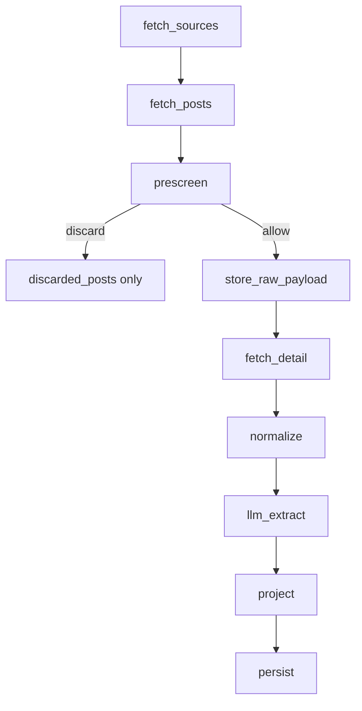

# Iter-1 PRD: Rule-First Opportunity Engine

Status: `active`  
Last updated: `2026-05-22`

## 1. Goal

Deliver a complete, runnable, maintainable, opportunity-first campus information system.

The system should help students find content they can still act on: registration, application, recruitment, lecture, competition, volunteer, exam, and similar opportunities.

It should suppress content that is not currently actionable: recaps, closures, congratulations, publicity results, introductions, opinions, tutorials, record-only posts, and garbled hidden-source posts.

## 2. Non-Negotiable Product Rules

- `post` is the only product content unit.
- The public API uses `/api/posts`; no legacy content compatibility endpoint is kept.
- Strong prescreening runs before raw payload storage, detail fetch, LLM extraction, projection, and persistence.
- Prescreened content writes only to `discarded_posts`.
- LLM may summarize and extract candidate fields once for new or changed posts.
- LLM must not decide `participation_status`, `time_status`, or `ranking_score`.
- Ranking is rule-derived and explainable.
- The frontend does not expose a product entry for discarded posts.

## 3. Strong Prescreen Categories

| Reason | Content Removed |
| --- | --- |
| `recap` | 活动总结、回顾、纪实、花絮、剪影 |
| `closure` | 落幕、闭幕、收官、结束、结营、结课 |
| `congratulation` | 恭喜、祝贺、喜报、表彰 |
| `publicity_result` | 名单、公示、结果公布、入围、录取、获奖 |
| `introduction` | 介绍、简介、科普、盘点、解读 |
| `opinion` | 观点、评论、随想、感悟、观察 |
| `tutorial` | 教程、指南、攻略、操作说明 |
| `record_only` | 记录、新闻稿、过程报道、会议纪要 |
| `garbled_hidden_source` | 乱码、随机字符、隐藏公众号残片 |

Prescreen uses title phrases, title keywords, summary/body auxiliary phrases, and garbled-content quality signals. It does not use "contains registration word" as a bypass.

## 4. Data Pipeline

Required active tables:

- `sources`
- `raw_payloads`
- `posts`
- `post_categories`
- `post_projections`
- `discarded_posts`
- `sync_jobs`
- `sync_job_items`

## 5. Summary Policy

- Use upstream summary first when it is usable.
- If no usable upstream summary exists, use one-time LLM summary generation for new or changed posts.
- If LLM fails, use deterministic sentence extraction.
- Summary supports scanning, search, and filtering. It is not a rewrite of the original text.

## 6. Rule-Derived Fields

`post_projections` owns the feed-facing rule output:

- `primary_category`
- `content_type`
- `event_start_at`
- `event_end_at`
- `deadline_at`
- `time_status`
- `timeliness_level`
- `participation_status`
- `ranking_score`
- `display_level`

Default ordering is `ranking_score desc`, then `published_at desc`, then `id desc`.

## 7. Public API

- `GET /api/posts`
- `GET /api/posts/{post_id}`
- `GET /api/posts/categories`
- `GET /api/sources`
- `POST /api/sync`
- `GET /api/sync/jobs/{job_id}`
- `GET /api/health`

Sync responses include `posts_discarded` and `discard_stats_by_reason`.

## 8. Acceptance Criteria

- Cloud `/api/health` is healthy.
- Cloud `/api/sync` can run against the real upstream.
- Cloud `/api/posts` returns opportunity-first posts.
- Cloud database has no legacy content tables.
- Prescreened content does not enter `raw_payloads`, `posts`, or `post_projections`.
- Frontend uses only `/api/posts` for content.
- Documentation has no competing stale contract.
- Deployment is one-command and performs health, posts API, and sync smoke checks when upstream credentials exist.
