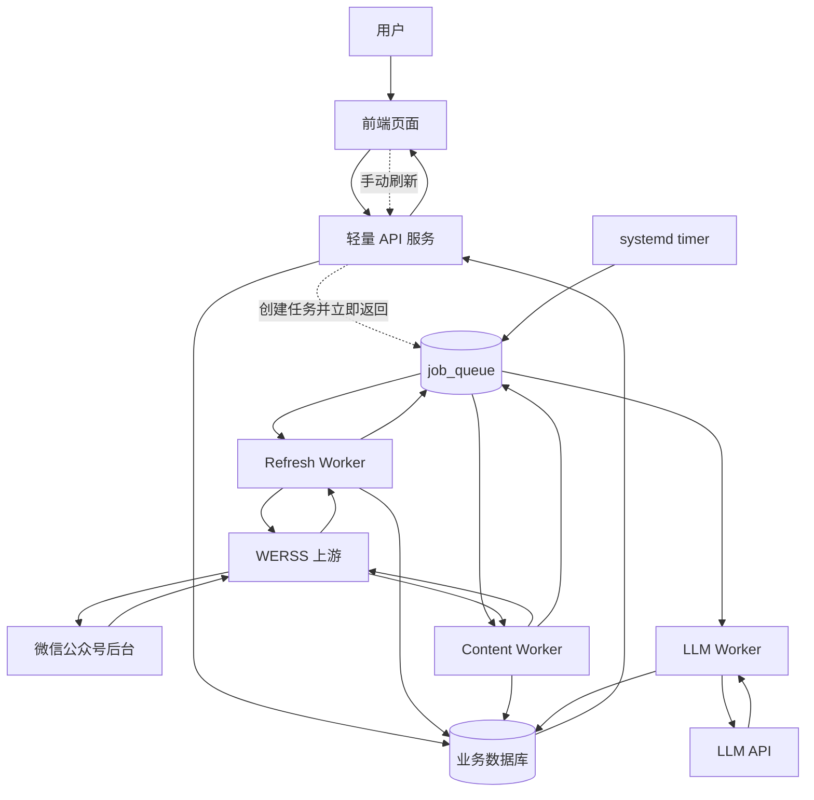
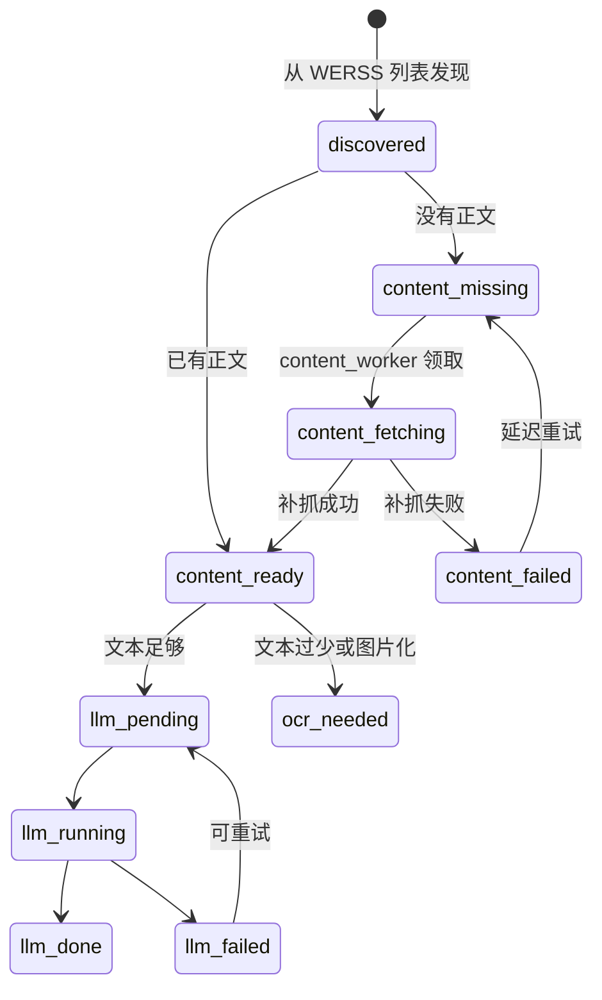
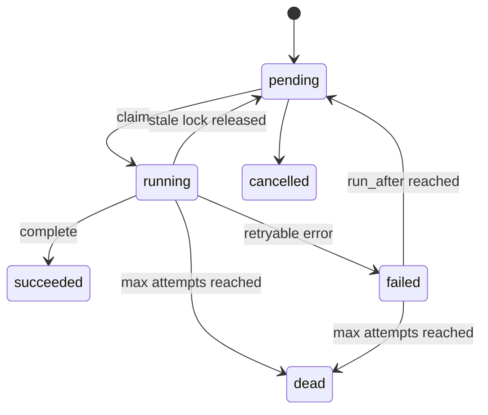

# MVP 第二轮：文章处理管线重构设计

## 背景

第一轮 MVP 已经把核心页面、文章列表、筛选、AI 摘要、点赞和同步结果展示跑通。但线上出现过一次明显的稳定性问题：WERSS 上游文章量突然增长到 4000+ 后，后台刷新、入库、LLM 处理和前端 API 共用同一个 FastAPI 进程与 SQLite 写入通道，最终导致数据库锁等待和接口超时。

第二轮 MVP 的目标不是追求“所有文章马上处理完”，而是让系统能稳定吞吐大量文章：

- 前端 API 始终快速可用。
- 文章刷新、正文补抓、AI 处理异步化。
- 高峰流量进入队列，worker 按限流策略慢慢消费。
- 任何阶段失败都可追踪、可重试、可降级展示。

## 当前状态

截至 2026-05-25，云端数据大致为：

| 数据源 | 数量 |
| --- | ---: |
| WERSS 总文章 | 4201 |
| WERSS 正常状态文章 | 4065 |
| WERSS 正常且已有 `content` | 1422 |
| 我们业务库 `posts` | 3717 |
| 我们业务库正文 `ready` | 672 |
| 我们业务库正文 `missing` | 3045 |
| LLM 已完成 | 495 |

当前线上为了止血，API 进程中的调度器和 LLM 队列已经关闭：

```env
BACKEND_ENABLE_SCHEDULER=false
BACKEND_UPSTREAM_REFRESH_ON_STARTUP=false
BACKEND_LLM_QUEUE_ENABLED=false
```

这保证了页面稳定，但后台不会自动完整消化上游文章。

## MVP 2 目标

### 必须实现

1. 新增一个数据库型消息队列 `job_queue`。
2. 把文章处理拆成独立 worker：
   - `refresh_worker`
   - `content_worker`
   - `llm_worker`
3. 前端或人工触发刷新时，只创建任务并立即返回。
4. worker 只通过 `job_queue` 交接，不互相直接调用。
5. 成功任务保留一段时间用于前端进度展示和排查。
6. API 进程不再执行慢抓取、慢补正文、LLM 网络请求。

### 暂不纳入

1. Kafka / RabbitMQ。
2. 完整 OCR 流水线。
3. PostgreSQL 迁移。
4. 多机器分布式 worker。
5. 实时 WebSocket 推送。

OCR 和 PostgreSQL 是后续演进方向，不是第二轮 MVP 的入口条件。

## 新流程



## 文章状态流

每篇文章在业务库里的状态应该尽量明确：



现有 `posts.content_status` 可先继续使用：

| 状态 | 含义 |
| --- | --- |
| `missing` | 只有标题、摘要、链接，缺正文 |
| `ready` | 已有可用于展示/LLM 的正文 |
| `failed` | 补正文失败，等待人工或延迟重试 |

第二轮可新增更细的 job 状态，不必立刻扩展 `content_status` 到很多枚举。

## 队列表设计

新增表：`job_queue`。

```sql
CREATE TABLE job_queue (
  id INTEGER PRIMARY KEY AUTOINCREMENT,
  job_type VARCHAR(64) NOT NULL,
  dedupe_key VARCHAR(255) NOT NULL,
  status VARCHAR(32) NOT NULL DEFAULT 'pending',

  priority INTEGER NOT NULL DEFAULT 100,
  payload_json TEXT NOT NULL DEFAULT '{}',

  attempts INTEGER NOT NULL DEFAULT 0,
  max_attempts INTEGER NOT NULL DEFAULT 3,
  run_after DATETIME NOT NULL,

  locked_by VARCHAR(128),
  locked_at DATETIME,

  last_error TEXT NOT NULL DEFAULT '',
  result_json TEXT NOT NULL DEFAULT '{}',

  created_at DATETIME NOT NULL,
  updated_at DATETIME NOT NULL,
  finished_at DATETIME
);
```

建议索引：

```sql
CREATE UNIQUE INDEX uq_job_queue_dedupe_active
ON job_queue(job_type, dedupe_key)
WHERE status IN ('pending', 'running');

CREATE INDEX ix_job_queue_claim
ON job_queue(status, run_after, priority, created_at);

CREATE INDEX ix_job_queue_finished
ON job_queue(status, finished_at);
```

SQLite 支持 partial index；如果后续迁 PostgreSQL，这个设计也能平滑迁移。

## 任务类型

| `job_type` | 负责方 | payload | 成功后动作 |
| --- | --- | --- | --- |
| `refresh_source` | Refresh Worker | `source_id`, `start_page`, `end_page` | 调 WERSS 刷新公众号列表，入队 `sync_source_posts` |
| `sync_source_posts` | Refresh Worker | `source_id`, `limit` | 从 WERSS 拉文章列表，写 `raw_payloads/posts`，入队 `fetch_content` 或 `llm_post` |
| `fetch_content` | Content Worker | `upstream_post_id`, `post_id` | 调 WERSS 单篇 refresh，补正文，入队 `llm_post` 或标记图片化 |
| `llm_post` | LLM Worker | `post_id`, `content_hash` | 写 AI 摘要、分类、时间字段 |
| `cleanup_jobs` | Maintenance Worker | `retention_days` | 清理旧成功任务 |

第二轮先实现前三条主链路：

```text
refresh_source -> sync_source_posts -> fetch_content -> llm_post
```

OCR 先只做识别标记，不做真实 OCR：

```text
content 有图片但文本少 -> result_json 标记 image_heavy=true
```

## Worker 与队列关系

worker 之间不直接通信。

```text
Refresh Worker 不调用 Content Worker。
Refresh Worker 只写 job_queue。
Content Worker 自己从 job_queue 领取 fetch_content。
```

这样某个 worker 慢、失败、重启，不会拖死其他链路。

## Job 状态

| 状态 | 含义 |
| --- | --- |
| `pending` | 等待执行 |
| `running` | 已被 worker 领取 |
| `succeeded` | 执行成功，保留历史 |
| `failed` | 本次失败，但还可重试 |
| `dead` | 超过最大重试，停止自动处理 |
| `cancelled` | 人工取消 |

状态机：



成功任务不立即删除。保留策略：

| 类型 | 保留时间 |
| --- | --- |
| `succeeded` | 7 天 |
| `failed/dead` | 30 天 |
| `cancelled` | 14 天 |

## Claim 逻辑

worker 每轮领取任务：

```text
1. 查 status in ('pending', 'failed')
2. run_after <= now
3. attempts < max_attempts
4. 按 priority asc, created_at asc
5. 标记 running, locked_by, locked_at
6. 提交事务
7. 执行业务逻辑
```

SQLite 阶段要保守：

- 单 worker 单进程。
- 每次 claim 1-5 个任务。
- 网络请求期间不持有数据库 session。
- DB 写入短事务。
- 遇到 `database is locked` 立即失败本轮，延迟重试。

## 去重策略

| 任务 | `dedupe_key` |
| --- | --- |
| `refresh_source` | `source:{source_id}:pages:{start}-{end}:hour:{yyyyMMddHH}` |
| `sync_source_posts` | `source:{source_id}:limit:{limit}` |
| `fetch_content` | `upstream:{upstream_post_id}` |
| `llm_post` | `post:{post_id}:hash:{content_hash}` |
| `cleanup_jobs` | `cleanup:{yyyyMMdd}` |

`llm_post` 必须带 `content_hash`。正文变化时允许重新处理，不变时禁止重复处理。

## 前端/API 合约

新增轻量接口：

| 方法 | 路径 | 说明 |
| --- | --- | --- |
| `POST` | `/api/jobs/refresh` | 创建刷新任务，立即返回 |
| `GET` | `/api/jobs/{id}` | 查看单个任务 |
| `GET` | `/api/jobs/summary` | 查看队列摘要 |

`POST /api/jobs/refresh` 返回示例：

```json
{
  "job_id": 123,
  "status": "pending",
  "message": "刷新任务已提交"
}
```

前端刷新按钮不再等待完整刷新完成，而是展示：

```text
任务已提交
队列中 120 个
正在处理 3 个
已完成 37 个
失败 2 个
```

这也能延续之前“同步结果面板”的展示价值。

## Worker 并发建议

MVP 2 初始配置：

| Worker | 频率 | batch | 并发 |
| --- | --- | ---: | ---: |
| Refresh Worker | 每 2 分钟 | 每轮 2 个 refresh/sync 任务 | 1 |
| Content Worker | 每 1-5 分钟 | 每轮 5 篇 | 1 |
| LLM Worker | 每 1-5 分钟 | 每轮 2 篇 | 1 |
| Cleanup Worker | 每天凌晨 | 旧任务 | 1 |

不要在 SQLite 阶段开多个写 worker。等迁 PostgreSQL 后再扩大并发。

## 落地步骤

### Step 1: 数据模型

- 新增 `JobQueue` model。
- 新增 `JobStatus`、`JobType` 枚举。
- 新增基础索引。

### Step 2: Queue Service

新增 `JobQueueService`：

- `enqueue(job_type, dedupe_key, payload, priority)`
- `claim(job_types, worker_id, limit)`
- `mark_succeeded(job_id, result)`
- `mark_failed(job_id, error)`
- `release_stale_locks(ttl_minutes)`
- `summary()`

### Step 3: Worker 入口

新增命令式入口：

```text
python -m app.workers.refresh_worker --once
python -m app.workers.content_worker --once
python -m app.workers.llm_worker --once
```

第一版用 `--once` 配合 systemd timer，避免常驻进程复杂度。

### Step 4: API 接口

新增 `/api/jobs/*`：

- 手动创建 refresh 任务。
- 查看队列概览。
- 查看单任务状态。

### Step 5: 云端部署

新增 systemd timer：

```text
campus-opportunity-enqueue-refresh.timer
campus-opportunity-refresh-worker.timer
campus-opportunity-content-worker.timer
campus-opportunity-llm-worker.timer
```

API 服务继续保持：

```env
BACKEND_ENABLE_SCHEDULER=false
BACKEND_UPSTREAM_REFRESH_ON_STARTUP=false
BACKEND_LLM_QUEUE_ENABLED=false
```

### Step 6: 验证指标

上线后必须看：

- `/api/health` 响应时间。
- `/api/posts?limit=5` 响应时间。
- `job_queue pending/running/succeeded/dead` 数量。
- `posts.content_status` 分布。
- `posts.llm_status` 分布。
- 日志里的 `database is locked` 数量。

## 已落地补点

实现和上线验证过程中新增了以下保护，避免队列本身制造新的高峰：

1. **补充入队器**
   `app.workers.enqueue_refresh_jobs --once` 负责定时把 enabled source 写入 `job_queue`。没有这个入口时，refresh worker 会醒来但没有任务可领。
2. **入队防重复**
   如果 `refresh_source` 仍有 `pending/running/failed` backlog，入队器会跳过本轮，避免每小时重复塞入同一批公众号刷新任务。
3. **同步任务优先级高于继续刷新**
   `sync_source_posts` 的优先级高于新的 `refresh_source`，这样一个公众号刷新后会优先同步落库，而不是先把所有公众号刷新完才同步。
4. **单 source 同步**
   refresh worker 处理 `sync_source_posts` 时只同步对应 source，不再调用全量 `run_sync()`，避免每个 source 都触发一次全量扫描。
5. **LLM 不可用时跳过**
   LLM worker 会先检查 LLM 配置是否可用，不可用时直接返回 `skipped`，不会把任务错误地标失败。
6. **删除/不可访问文章保护**
   content worker 遇到 WERSS 返回 `DELETED` 时不会把文章误标为 `ready`。

## 运维验证 Runbook

### 1. 确认 API 仍是轻量模式

```bash
grep -E 'BACKEND_ENABLE_SCHEDULER|BACKEND_LLM_QUEUE_ENABLED|BACKEND_UPSTREAM_REFRESH_ON_STARTUP' \
  /etc/campus-opportunity/backend.env
```

期望：

```text
BACKEND_ENABLE_SCHEDULER=false
BACKEND_LLM_QUEUE_ENABLED=false
BACKEND_UPSTREAM_REFRESH_ON_STARTUP=false
```

### 2. 确认 API 健康

```bash
curl -sS --max-time 10 http://127.0.0.1:8002/api/health
curl -sS --max-time 10 'http://127.0.0.1:8002/api/posts?limit=1'
```

期望：

```text
/api/health 返回 ok
/api/posts 能在 10 秒内返回
```

### 3. 确认 timer 已启用

```bash
systemctl list-timers 'campus-opportunity-*' --no-pager --all
```

应该看到：

```text
campus-opportunity-enqueue-refresh.timer
campus-opportunity-refresh-worker.timer
campus-opportunity-content-worker.timer
campus-opportunity-llm-worker.timer
```

### 4. 查看队列摘要

```bash
curl -sS http://127.0.0.1:8002/api/jobs/summary
```

也可以直接查库：

```bash
sqlite3 /var/lib/campus-opportunity/backend.db \
  "select job_type,status,count(*) from job_queue group by job_type,status order by job_type,status;"
```

健康信号：

```text
refresh_source 会逐步出现 succeeded
sync_source_posts 会出现 succeeded
fetch_content succeeded 会逐步增长
dead/failed 不应持续增长
```

### 5. 查看 worker 日志

```bash
journalctl -u campus-opportunity-refresh-worker.service -n 50 --no-pager
journalctl -u campus-opportunity-content-worker.service -n 50 --no-pager
journalctl -u campus-opportunity-llm-worker.service -n 50 --no-pager
```

健康日志示例：

```text
{'status': 'completed', 'claimed': 1, 'completed': 1, 'failed': 0}
{'status': 'completed', 'claimed': 5, 'completed': 5, 'failed': 0}
```

### 6. 看正文和 LLM 状态是否推进

```bash
sqlite3 /var/lib/campus-opportunity/backend.db \
  "select content_status,count(*) from posts group by content_status;"

sqlite3 /var/lib/campus-opportunity/backend.db \
  "select llm_status,count(*) from posts group by llm_status;"
```

期望：

```text
content_status=ready 逐步增加
content_status=missing 逐步下降
llm_status=completed 在 LLM 配置可用时逐步增加
```

### 7. 确认没有测试残留进程

```bash
ps -eo pid,args | awk '/python -m app[.]workers|pytest/ {print}'
```

正常情况下，worker 是 timer 短跑，任务结束后应退出。只有 timer 正在执行窗口内才会短暂看到对应 worker 进程。

## MVP 2 完成标准

1. 前端刷新按钮不再触发长同步请求。
2. 刷新、补正文、LLM 都能在 API 进程外执行。
3. 4000+ 上游文章存在时，前端列表接口仍可稳定返回。
4. 缺正文文章数量会随 content worker 持续下降。
5. LLM 完成数会随 llm worker 持续增长。
6. 任一 worker 失败后，任务仍可追踪并重试。

## 后续演进

当出现以下条件之一时，进入第三轮：

- 正常文章超过 1 万。
- 每天新增超过 1000 篇。
- 需要多个 content/LLM worker 并发。
- `database is locked` 仍频繁出现。
- OCR 成为核心功能。

第三轮建议：

```text
SQLite -> PostgreSQL
DB-backed queue -> Redis/RQ 或 PostgreSQL SKIP LOCKED
图片化文章 -> OCR Worker
队列状态 -> 前端实时进度面板
```
