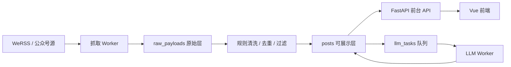

# Traffic Isolation Plan

## 背景

2026-05-23，公众号数据源一次性增长到 4000+ 篇文章后，线上前端出现“卡死”。排查结果不是静态资源或 Vue 渲染问题，而是所有 `/api/*` 请求都超时。

直接原因：

- 后台同步、入库、LLM 队列和前台 API 共用同一个 FastAPI 进程。
- SQLite 同一时间只有一个写锁。大批量入库或 LLM 回写时，其他请求等待数据库锁。
- 旧配置的 SQLite `busy_timeout=60s` 会在 FastAPI 事件循环里阻塞等待，导致 `/api/health`、`/api/posts`、`/api/support` 也被拖住。
- 启动时自动刷新上游 0-10 页、定时同步、LLM worker 可能在部署后立刻抢锁。

这不是“文章多就不行”，而是缺少在线链路和后台吞吐链路隔离。

## 结论

可以把它理解为“接口分离”，但更准确是三层分离：

1. **前台在线 API 链路**
   面向用户访问，只读为主，必须快速返回、可降级。

2. **后台抓取/入库链路**
   面向 WeRSS / 公众号源，允许慢，但必须分批、限流、可恢复。

3. **后台 LLM 增强链路**
   面向摘要、分类、时间字段补全，必须异步处理，不影响文章先展示。

接口分离只是表象；核心是 **运行时隔离、锁隔离、流量削峰**。

## 当前止血状态

线上已采用保守配置，保证前台可用：

| 配置 | 当前值 | 目的 |
| --- | --- | --- |
| `BACKEND_ENABLE_SCHEDULER` | `false` | API 进程不自动跑重后台任务 |
| `BACKEND_UPSTREAM_REFRESH_ON_STARTUP` | `false` | 部署/重启时不立刻拉 0-10 页 |
| `BACKEND_LLM_QUEUE_ENABLED` | `false` | API 进程不内嵌 LLM worker |
| SQLite busy timeout | `5s` | 遇到锁快速失败，不阻塞前台几十秒 |
| 前端 Axios timeout | `15s` | API 异常时前端能失败恢复 |

这保证演示和访问稳定，但后台自动吞吐需要用独立 worker 重新打开。

## 目标架构



## 在线 API 合约

前台 API 必须满足：

- 不主动触发上游抓取。
- 不主动触发 LLM 网络请求。
- 不执行超大批量写入。
- 数据库锁等待不超过 5 秒。
- 分类统计、支持数等非核心接口失败时，前端可降级。

当前在线接口包括：

| 方法 | 路径 | 性质 |
| --- | --- | --- |
| `GET` | `/api/health` | 健康检查 |
| `GET` | `/api/posts` | 机会列表 |
| `GET` | `/api/posts/{id}` | 机会详情 |
| `GET` | `/api/posts/categories` | 统计，可降级 |
| `GET/POST` | `/api/support` | 点荔枝支持 |
| `GET` | `/api/sources` | 数据源列表 |

`POST /api/sync` 只能作为人工维护入口，不应给普通用户触发。

## 后台 Worker 合约

后台任务应该作为独立进程或 systemd timer 运行。

### 抓取 Worker

职责：

- 调用 WeRSS 刷新公众号文章。
- 从 WeRSS 拉取文章列表。
- 分批入库和更新投影。
- 只把需要 LLM 的文章标记为 `pending`。

约束：

- 每批提交，建议每批 50-100 条。
- 单个 worker 串行写库，不开多个写 worker 抢 SQLite。
- 每个公众号刷新之间保留 delay。
- 记录 sync job 和失败原因，允许下次续跑。

### LLM Worker

职责：

- 从 `llm_tasks` 领取少量任务。
- 调用 LLM 生成摘要、分类候选、时间候选。
- 回写 `posts`、`post_categories`、`post_projections`。

约束：

- 不在持有数据库 session 时等待 LLM 网络请求。
- 单批 1-2 条，失败重试有限次。
- LLM 结果只作为候选，最终展示和排序仍由规则兜底。
- 遇到 SQLite lock 快速跳过本轮，不能阻塞在线 API。

## 落地阶段

### Phase 0: 已完成止血

- 停止 API 进程里的 scheduler / startup refresh / LLM queue。
- 降低 SQLite 锁等待。
- 前端增加接口超时和降级。
- 后台任务包装为线程执行，避免阻塞 FastAPI event loop。

### Phase 1: 独立 Worker 脚本

新增两个命令式入口：

- `python -m app.workers.refresh_worker`
- `python -m app.workers.llm_worker`

这两个 worker 复用现有 `IngestionService` 和 `LlmQueueService`，但不由 FastAPI lifespan 启动。

### Phase 2: systemd timer 调度

建议服务：

- `campus-opportunity-api.service`
- `campus-opportunity-refresh.service`
- `campus-opportunity-refresh.timer`
- `campus-opportunity-llm-worker.service`
- `campus-opportunity-llm-worker.timer`

建议频率：

| Worker | 频率 | 并发 |
| --- | --- | --- |
| Refresh worker | 每 60 分钟 | 1 |
| LLM worker | 每 1-5 分钟 | 1 |

所有 worker 必须 `flock`，确保同类任务不会重叠运行。

### Phase 3: 数据库升级条件

SQLite 可以继续支撑 demo 和单 worker，但满足任一条件就应迁 PostgreSQL：

- 文章量超过 1 万且每天新增超过 1000。
- LLM worker 需要并发超过 1。
- 前台搜索、统计、同步写入经常同时发生。
- 锁等待或 5xx 每天出现。

迁 PostgreSQL 后，抓取 worker、LLM worker、API 可以真正并发，且不会受 SQLite 单写锁限制。

## 运维开关

生产 API 服务默认应该使用：

```env
BACKEND_ENABLE_SCHEDULER=false
BACKEND_UPSTREAM_REFRESH_ON_STARTUP=false
BACKEND_LLM_QUEUE_ENABLED=false
```

独立 worker 进程才允许使用：

```env
BACKEND_ENABLE_SCHEDULER=false
BACKEND_UPSTREAM_REFRESH_ENABLED=true
BACKEND_LLM_QUEUE_ENABLED=true
```

注意：`BACKEND_ENABLE_SCHEDULER=true` 只适合本地小数据调试，不适合作为线上 API 进程默认值。

## 监控指标

至少需要持续观察：

- `/api/health` 响应时间。
- `/api/posts?limit=5` 响应时间。
- `sync_jobs` 最近任务状态、抓取数、入库数、过滤数。
- `llm_tasks` pending/running/failed/completed 数。
- 日志中的 `database is locked`。
- 每次 refresh worker 的耗时和新增文章数。

## 决策记录

- 前台必须优先可用，即使后台 LLM 延迟。
- 新文章先用规则分类展示，再异步补 LLM 摘要。
- 不再在 API 进程启动时自动刷新 0-10 页。
- SQLite 阶段只允许一个写 worker；需要高并发时迁 PostgreSQL。
